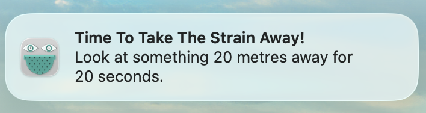
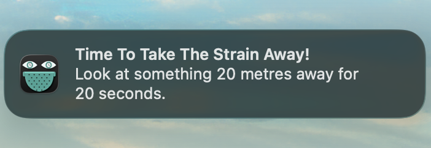
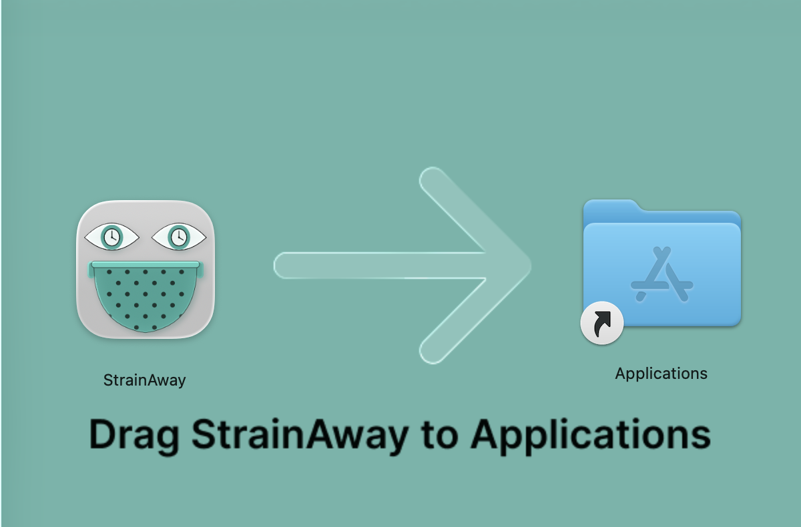

# StrainAway 

An eye break reminder app, available for macOS and Windows.

Following the 20-20-20 rule: every 20 minutes, StrainAway reminds you to look at something 20 metres
away for 20 seconds — a simple habit for **reducing digital eye strain**.

**Disclaimer: This application is a general wellness tool designed to encourage ergonomic screen breaks. It does not provide medical advice, diagnosis, or treatment. The 20-20-20 guidance is a general habit recommendation and should not replace professional ophthalmic or medical consultation.**

## Screenshots

### Menu bar

| Light mode | Dark mode |
|---|---|
|  |  |

### Notifications

| Light mode | Dark mode |
|---|---|
|  |  |

### Installer

## macOS

Native menu bar app built with Swift and SwiftUI.
See the [mac README.md](mac/README.md) file for setup and build instructions.

## Windows

Cross-platform system tray app built with Python.
See the [windows README.md](windows/README.md) file for setup and build instructions.
Please note that it is still in its pre-release phase.

## Privacy

StrainAway does not collect, store, or transmit any data. It makes no
network requests. The only system permission it requests is local
notification access, used solely to display break reminders. Nothing
about your usage, screen content, or activity is monitored, logged, or
sent anywhere.

The only persistent change it makes to your system is a single
registry entry (Windows) or LaunchAgent file (macOS) if you enable
"launch at login" — both are standard, removable via the app's own
toggle.

This is open source — you're welcome to verify all of this by reading
the source code directly.

## Licence

This project is licensed under the MIT License — see the [LICENSE](LICENSE) file for details.

## Further reading on the 20-20-20 rule
[Deconstructing the 20-20-20 rule for digital eye strain](https://www.optometrytimes.com/view/deconstructing-20-20-20-rule-digital-eye-strain) — Optometry Times

## Author
ClinicalScript

This project — code, documentation, and design — was built with the
assistance of Claude (Anthropic).
