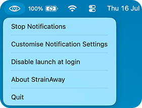
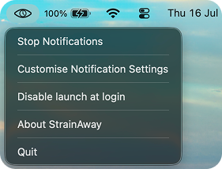
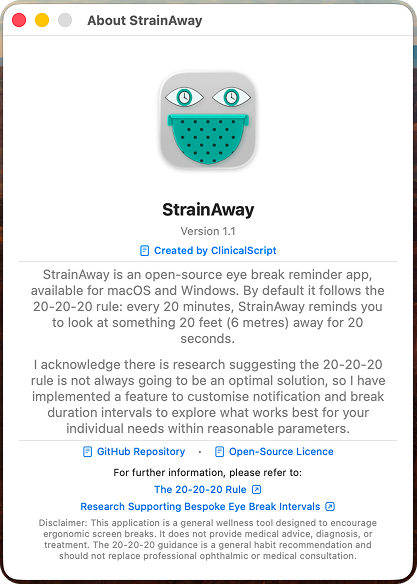
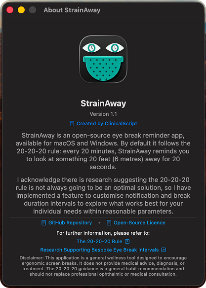
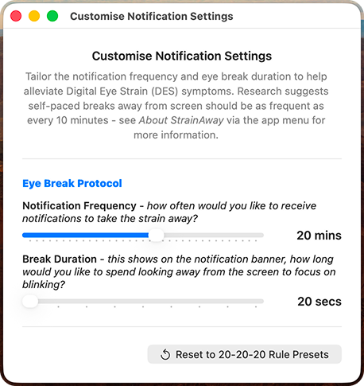
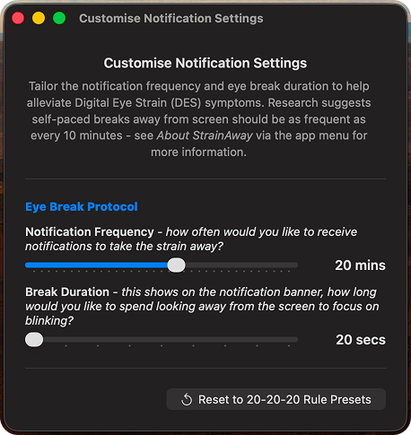
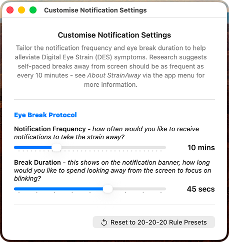
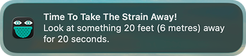
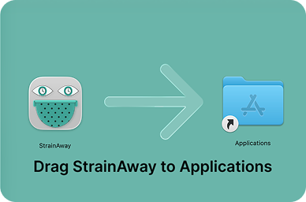

# StrainAway 

An eye break reminder app, available for macOS and Windows.

By default the app follows the 20-20-20 rule: every 20 minutes, StrainAway reminds you to look at something 20 feet (6 metres)
away for 20 seconds — a simple habit to help **reduce digital eye strain (DES)**.

There is research to suggest the 20-20-20 rule may not be as affective as once believed, 
to address this I have added a custom notification interval and break duration feature on macOS-v1.1.

**Disclaimer: This application is a general wellness tool designed to encourage ergonomic screen breaks. It does not provide medical advice, diagnosis, or treatment. This app acts as a general habit promoting tool and should not replace professional ophthalmic or medical consultation.**

# MacOS-v1.1 Screenshots

## Menu bar

**Light mode**

**Dark mode**

## Menu

**Light mode** 

**Dark mode**

## About StrainAway

**Light mode**

**Dark mode**

## Customise Notification Settings

**Light mode, Default settings**

**Dark mode, Default settings**

**Light mode, Customised settings**

## Notifications

**Light mode**

 

**Dark mode**

**Light mode, notification from customised setting**

## Installer

## macOS

Native menu bar app built with Swift and SwiftUI.
See the [macOS README.md](macOS/README.md) file for setup and build instructions.

## Windows

Cross-platform system tray app built with Python.
See the [windows README.md](windows/README.md) file for setup and build instructions.
Please note that it is still in its pre-release phase.

## Privacy

StrainAway does not collect, store, or transmit any data. It makes no
network requests. The only system permission it requests is local
notification access, used solely to display break reminders. Nothing
about your usage, screen content, or activity is monitored, logged, or
sent anywhere.

The only persistent change it makes to your system is a single
registry entry (Windows) or LaunchAgent file (macOS) if you enable
"launch at login" — both are standard, removable via the app's own
toggle.

This is open source — you're welcome to verify all of this by reading
the source code directly.

## Licence

This project is licensed under the MIT License — see the [LICENSE](LICENSE) file for details.

## Further reading on the 20-20-20 rule and Custom Intervals to help reduce digital eye strain (DES)

[Deconstructing the 20-20-20 rule for digital eye strain](https://www.optometrytimes.com/view/deconstructing-20-20-20-rule-digital-eye-strain) — Optometry Times

[Research suggesting custom time intervals (available on macOS-v1.1) may be superior to the 20-20-20 rule](https://www.sciencedirect.com/science/article/abs/pii/S0014483525002349?via%3Dihub) - Science Direct (Elsevier)

## Author
ClinicalScript

This project — code, documentation, and design — was built with the
assistance of Claude (Anthropic) and Gemini (Google).
